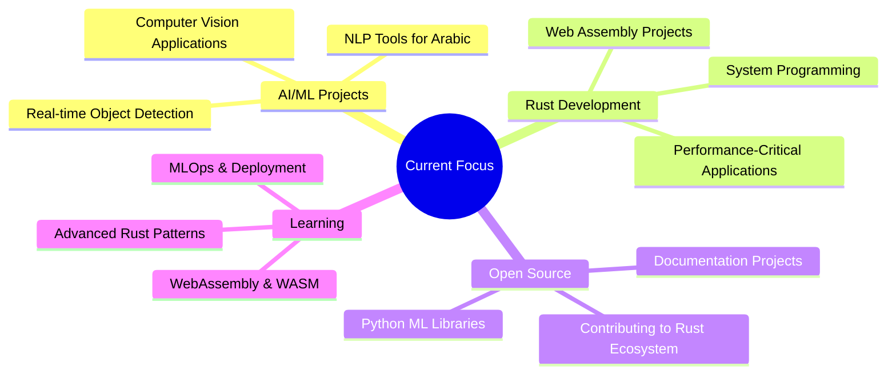

# Hi there, I'm Khaled Mahmoud! 

---

## 🚀 Quick Overview

---

## 🧑‍💻 About Me

I'm a versatile developer passionate about building intelligent solutions and empowering developers through clean code and clear documentation. My expertise spans:

- **🤖 AI/ML Development**: Building predictive models, NLP systems, and computer vision applications
- **📱 Cross-Platform Apps**: Python, Flutter, PyQt, Custom Tkinter, and Dioxus GUI solutions
- **🔄 Automation Architect**: Web scraping workflows, CI/CD pipelines, and process automation
- **🌍 Tech Communication**: Bridging language gaps in Arabic/English/German technical documentation
- **⚡ Performance Optimization**: System-level programming with Rust and C++ for embedded systems

---

## 🌟 Currently Working On

- 🤖 **Enhanced CV Analyzer**: Adding multilingual support and AI-powered recommendations
- 🦀 **Rust**: completing course pilot
- 🌐 **Open Source Contributions**: Contributing to Dioxus framework and ML libraries
- 📚 **Technical Writing**: Creating comprehensive documentation for complex systems
- 🎯 **MLOps Pipeline**: Developing automated ML model deployment workflows

---

## 🔧 Technical Arsenal

### 🤖 AI/ML & Data Science

### 💻 Frameworks & Tooling

### 🌐 Web & Automation

### 🛠️ DevOps & Tools

### 💾 Databases & Cloud

## 

## 🏅 Achievements & Stats

### 📊 Quick Stats

|        📊 **Metric**        |                                       📈 **Count**                                       |          🚀 **Notes**           |
| :-------------------------: | :--------------------------------------------------------------------------------------: | :-----------------------------: |
| 📚 **Public Repositories**  |                                           28+                                            |            ⬆️ Active            |
|    🤖 **AI/ML Projects**    |                                            7+                                            | Computer Vision, NLP, Analytics |
| 🖥️ **Desktop Applications** |                                            8+                                            |    Modern UIs in Production     |
|     ⭐ **Total Stars**      |        |             Growing             |
|      👥 **Followers**       |  |        Active Community         |

---

## 🎯 Recent Focus Areas

- Developing ML-powered applications with TensorFlow and PyTorch
- Building responsive UIs with PyQt6 and Dioxus Framework
- Creating Multilingual NLP tools for low-resource language processing
- Automating workflows with Python scripting + GitHub Actions
- Contributing to open-source Rust ecosystem projects

---

## 🤝 Let's Collaborate

### 🚀 I'm actively seeking:

🔬 **AI/ML research collaborations**
💼 **Job opportunities in Backend & AI/ML & App Development**
💼 **Freelancing opportunities in Fullstack App Development & Web & automation & ML**
🌟 **Open-source contributions**
📝 **Multilingual documentation projects**
🤖 **Custom automation solutions**
🎯 **Performance optimization challenges**

### 📬 Connect with me:

---

## ✨ "Code is poetry written in logic" ✨

---

_Open Source Love | Made with ❤️ by Khaled Mahmoud_

